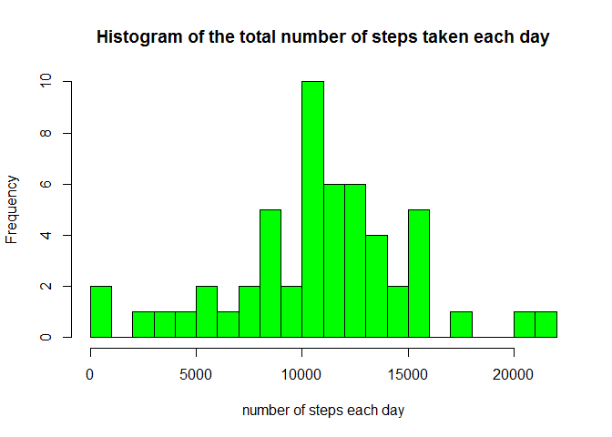
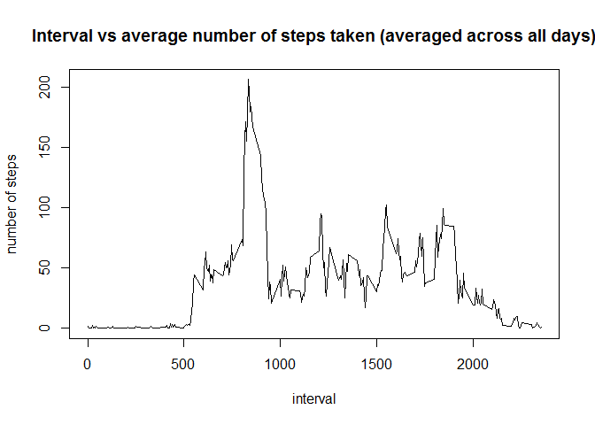
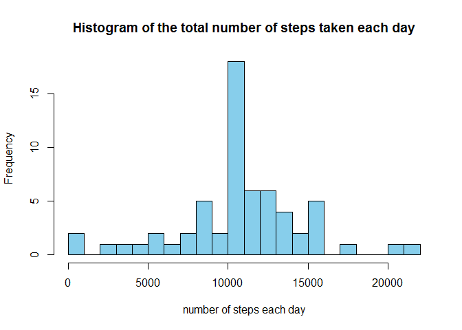
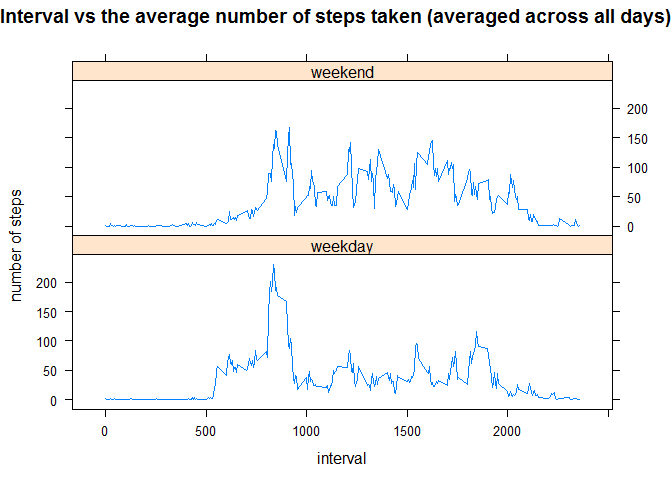

# Reproducible Research: Peer Assessment 1

## Loading and preprocessing the data

Assuming the activity.zip file is present in the working directory, the dataset is unzipped and loaded into R.


```r
unzip("activity.zip")
activity<-read.csv("activity.csv")
str(activity)  #structure of the dataset
```

```
## 'data.frame':	17568 obs. of  3 variables:
##  $ steps   : int  NA NA NA NA NA NA NA NA NA NA ...
##  $ date    : Factor w/ 61 levels "2012-10-01","2012-10-02",..: 1 1 1 1 1 1 1 1 1 1 ...
##  $ interval: int  0 5 10 15 20 25 30 35 40 45 ...
```

```r
summary(activity)  #summary of the dataset
```

```
##      steps                date          interval     
##  Min.   :  0.00   2012-10-01:  288   Min.   :   0.0  
##  1st Qu.:  0.00   2012-10-02:  288   1st Qu.: 588.8  
##  Median :  0.00   2012-10-03:  288   Median :1177.5  
##  Mean   : 37.38   2012-10-04:  288   Mean   :1177.5  
##  3rd Qu.: 12.00   2012-10-05:  288   3rd Qu.:1766.2  
##  Max.   :806.00   2012-10-06:  288   Max.   :2355.0  
##  NA's   :2304     (Other)   :15840
```

Given the discription of the dataset in README.md it is preferred to have the variable date as Date data type and interval as factor instead of factor and int respectively.


```r
activity$date<-as.Date(activity$date)
```

Creating a dataset without missing values(NA).


```r
noNA<-activity[complete.cases(activity),]
```

## What is mean total number of steps taken per day?

The total number of steps taken each day is calculated and a histogram of the data is presented.


```r
stepsum<-tapply(noNA$steps,noNA$date,sum) #steps taken per day
hist(stepsum,xlab="number of steps each day",main="Histogram of the total number of steps taken each day",col="green",breaks=20)
```

 

The mean number of steps taken each day:


```r
mean(stepsum)
```

```
## [1] 10766.19
```

The median number of steps taken each day:


```r
median(stepsum)
```

```
## [1] 10765
```

## What is the average daily activity pattern?

The average number of steps (averaged across all days) in a five minute interval is calculated and a time series plot is presented.


```r
stepsint<-tapply(noNA$steps,noNA$interval,mean) #steps per interval averaged acrross all days
plot(as.numeric(names(stepsint)),stepsint,type="l",xlab="interval",ylab="number of steps",main="Interval vs average number of steps taken (averaged across all days)")
```

 

The 5-minute interval that, on average, contains the maximum number of steps:


```r
names(which.max(stepsint))
```

```
## [1] "835"
```

## Imputing missing values

The total number of missing values in the original dataset (activity):


```r
sum(1-complete.cases(activity))
```

```
## [1] 2304
```

The missing values in the original dataset are filled in using the mean, rounded to the nearest integer, of the 5-minute interval averaged over all other days, and a new dataset is created with the missing data filled in.


```r
full<-activity 
na_row<-is.na(full$steps)
full$steps[na_row]<-round(stepsint[as.character(full$interval[na_row])])
```

The total number of steps taken each day is now calculated again and a histogram of the data is presented.


```r
fullsum<-tapply(full$steps,full$date,sum) #steps taken per day
hist(fullsum,xlab="number of steps each day",main="Histogram of the total number of steps taken each day",col="skyblue",breaks=20)
```

 

The mean number of steps taken each day:


```r
mean(fullsum)
```

```
## [1] 10765.64
```

The median number of steps taken each day:


```r
median(fullsum)
```

```
## [1] 10762
```

Percentage difference between earlier and current estimate of the mean and median: 


```r
(mean(stepsum)-mean(fullsum))/mean(stepsum)*100
```

```
## [1] 0.005102409
```

```r
(median(stepsum)-median(fullsum))/median(stepsum)*100
```

```
## [1] 0.02786809
```

The mean and median with all the missing values imputed is lower than the earlier estimates; however, this difference is miniscule (< 0.03%). The variation in the mean is due to the rounding of the average steps per interval to integers before filling them in, thus the imputed missing values can be said to be fairly accurate. 

## Are there differences in activity patterns between weekdays and weekends?

Creating a new factor variable in the dataset with two levels, "weekday" and "weekend", indicating whether a given date is a weekday or weekend.


```r
full$day<-weekdays(full$date) #column showing days of the week
weekend<-c("Saturday","Sunday")
for(n in 1:nrow(full)){
  if (full$day[n] %in% weekend){
    full$daytype[n]="weekend"
    }
  else{
    full$daytype[n]="weekday"
    }
  }
full$daytype<-as.factor(full$daytype) #column showing weekend or weekday
```

The average number of steps in a five minute interval is calculated for weekdays and weekends and a time series panel plot is presented.


```r
fullint<-aggregate(steps~interval+daytype,data=full,FUN=mean) #steps per interval for weekend and weekday
library(lattice)
xyplot(steps~interval|daytype,data=fullint,type="l",layout=c(1,2),main="Interval vs the average number of steps taken (averaged across all days)",xlab="interval",ylab="number of steps")
```

 

From the plots we can see that the early hours of a day see more activity on weekdays, however during the rest of the day the weekends seem to have more activity than weekends. The average number of steps over the weekdays and weekends is calculated.


```r
s<-aggregate(steps~date+daytype,data=full,FUN=sum)
aggregate(steps~daytype,data=s,FUN=mean)
```

```
##   daytype    steps
## 1 weekday 10255.29
## 2 weekend 12201.00
```
